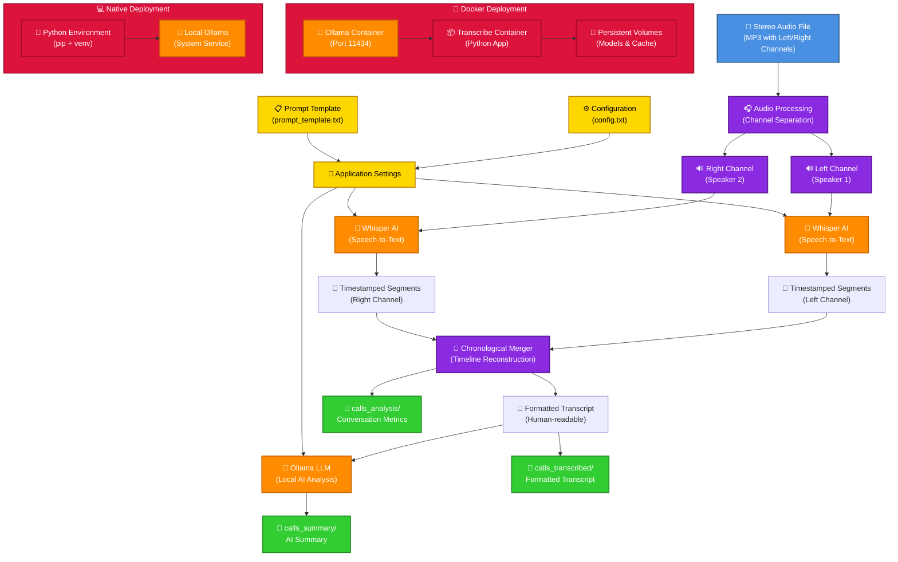

# Phone Call Transcription and Summarisation

This project transcribes stereo phone call recordings and generates AI-powered summaries using local Ollama LLM. It can either be run native on your machine, or via Docker containers. It relies on the fact that the audio files have one caller on the left and another on the right.

## Architecture



### Key Components

- **Audio Processing**: Separates stereo channels representing different speakers
- **Whisper AI**: Performs speech-to-text conversion with precise timestamps
- **Chronological Merger**: Reconstructs conversation timeline from both channels
- **Ollama LLM**: Provides local AI analysis and summarisation
- **Configuration System**: Flexible settings for models, speakers, and prompts
- **Dual Deployment**: Docker (recommended) or native Python installation

## Features

- **Stereo Channel Separation**: Automatically separates left and right audio channels representing different speakers
- **Chronological Transcription**: Creates time-ordered conversation flow with precise timestamps
- **High-Quality Transcription**: Uses OpenAI Whisper with timing information for accurate speech-to-text conversion
- **Human-Readable Format**: Professional transcript layout with timestamps, speaker labels, and clean text
- **Conversation Analytics**: Detailed statistics on speaking time, turns, and conversation dynamics
- **Local AI Summarisation**: Uses Ollama (llama3.1) running locally for intelligent call summaries
- **Customisable AI Prompts**: Easy-to-edit prompt templates for tailored analysis (customer service, sales, medical, etc.)
- **Docker Support**: Fully containerised with isolated Ollama service for consistent deployments
- **Flexible Deployment**: Choose between Docker (recommended) or native Python installation

## Prerequisites

### System Requirements
- **8GB RAM minimum** for AI summarisation features
- **6GB storage** for models and cache
- **Docker environment with 8GB RAM** (for Colima: `colima start --memory 8`)

### Docker Installation (Recommended)
1. **Docker** and **Docker Compose** installed
2. **Docker environment running with 8GB+ RAM**

### Native Installation
1. **Python 3.11+** (managed by pyenv)
2. **Ollama** installed and running locally
3. **8GB+ RAM** for optimal performance

## Quick Start

### Docker (Recommended)
```bash
# Setup (one-time)
colima start --memory 8  # For Colima users
./docker-run.sh setup

# Run
cp your_audio_file.mp3 calls_to_process/
./docker-run.sh single your_audio_file.mp3
```

### Native
```bash
# Setup (one-time)
pyenv install 3.11.13
curl -fsSL https://ollama.ai/install.sh | sh
ollama serve & && ollama pull llama3.1
python3 -m venv venv && source venv/bin/activate
pip install -r requirements.txt

# Run
source venv/bin/activate
cp your_audio_file.mp3 calls_to_process/
python transcribe_and_summarise.py --file your_audio_file.mp3
```

## Usage

### Basic Commands

**Docker:**
```bash
./docker-run.sh single <file>     # Process single file
./docker-run.sh batch             # Process all files in calls_to_process/
./docker-run.sh logs              # View logs
./docker-run.sh stop              # Stop services
./docker-run.sh cleanup           # Complete cleanup
```

**Native:**
```bash
source venv/bin/activate
python transcribe_and_summarise.py --file <file>    # Single file
python transcribe_and_summarise.py --batch          # Batch processing
python transcribe_and_summarise.py --language english  # Force language
```

### File Organisation
```
calls_to_process/     # Input: Place audio files here
calls_transcribed/    # Output: Transcription files (.txt)
calls_summary/        # Output: AI summaries (.txt)
calls_analysis/       # Output: Conversation analysis (.txt)
```

### Advanced Options

**Language Options:**
- `--language auto` (default): Automatic detection
- `--language english`: Force English (faster)
- `--language spanish/french/german/etc.`: Other languages

**Batch Processing Options:**
- `--batch`: Process all files in calls_to_process/
- `--input-folder custom_folder`: Process from custom directory
- `--force`: Reprocess existing files

**Testing & Configuration:**
- `python test_ollama.py`: Test Ollama connection
- `python configure.py`: Interactive configuration menu

## Output Files

The system generates three types of output for each processed audio file:

1. **Transcript** (`calls_transcribed/filename.txt`)
   - Chronologically ordered conversation with timestamps
   - Speaker labels (configurable: Customer/Agent by default)
   - Clean, human-readable format

2. **AI Summary** (`calls_summary/filename.txt`)
   - Key topics discussed
   - Action items and commitments
   - Decisions made and next steps
   - Overall tone and customer satisfaction

3. **Conversation Analysis** (`calls_analysis/filename.txt`)
   - Speaking time per speaker (percentages and duration)
   - Turn-taking patterns and frequency
   - Average turn length statistics

## How It Works

1. **Audio Processing**: Loads the MP3 file and separates stereo channels
2. **Transcription**: Uses Whisper to transcribe each channel separately
3. **Formatting**: Combines transcriptions with speaker labels
4. **Summarisation**: Sends transcript to local Ollama for analysis
5. **Output**: Saves both transcript and summary to text files

## Project Structure

```
Transcribe/
├── activitycall.mp3              # Input audio file (single file mode)
├── transcribe_and_summarise.py   # Main script with batch processing
├── configure.py                  # Configuration interface
├── test_ollama.py               # Ollama connectivity test
├── requirements.txt             # Python dependencies
├── .python-version              # Python version for pyenv
├── config.txt                   # Configuration settings
├── prompt_template.txt          # AI analysis prompt template
├── docker-compose.yml           # Docker services configuration
├── Dockerfile                   # Docker image definition
├── docker-entrypoint.sh         # Docker startup script
├── docker-run.sh                # Docker convenience commands
├── docker.env                   # Docker environment variables
├── .dockerignore                # Docker build exclusions
├── calls_to_process/            # Input folder for batch processing
├── calls_transcribed/           # Output folder for transcripts
├── calls_summary/               # Output folder for summaries
├── calls_analysis/              # Output folder for conversation analysis
├── call_transcript.txt          # Generated transcript (single mode)
├── call_summary.txt             # Generated summary (single mode)
└── conversation_analysis.txt    # Generated analysis (single mode)
```

## Dependencies

All dependencies are managed via `requirements.txt`:
- `faster-whisper==1.1.1` - High-performance transcription engine (optimized for all platforms)
- `pydub==0.25.1` - Audio processing
- `SpeechRecognition==3.10.0` - Fallback transcription
- `requests==2.31.0` - Ollama API communication
- `tqdm==4.67.0` - Progress bars

## Troubleshooting

### Docker Issues

#### Services Not Starting
```bash
# Check Docker daemon is running
docker info

# Check service status
docker-compose ps

# View detailed logs
./docker-run.sh logs

# Restart services
./docker-run.sh stop
./docker-run.sh start

# Complete rebuild if needed
docker-compose build --no-cache
```

#### Ollama Model Issues
```bash
# Check if model is available
docker-compose exec ollama ollama list

# Pull model manually
docker-compose exec ollama ollama pull llama3.1:latest

# Check Ollama service health
docker-compose exec ollama ollama list

# View Ollama logs specifically
./docker-run.sh logs ollama
```

#### Volume/Permission Issues
```bash
# Check directory permissions
ls -la calls_to_process calls_transcribed calls_summary calls_analysis

# Recreate directories with proper permissions
./docker-run.sh setup

# If permission issues persist on Linux/macOS:
sudo chown -R $USER:$USER calls_*
```

#### Performance Issues
```bash
# Check system resources
docker stats

# Increase Docker memory limits in Docker Desktop if needed
# Stop other containers to free resources
docker stop $(docker ps -q)
```

### Native Installation Issues

### Ollama Connection Issues
```bash
# Check if Ollama is running (native installation)
ollama list

# Start Ollama if needed
ollama serve
```

### Audio Processing Issues
- Ensure `activitycall.mp3` exists in the project directory
- Check that the file is a stereo MP3 with speakers on left/right channels

### Environment Issues
```bash
# Recreate virtual environment if needed
rm -rf venv
python3 -m venv venv
source venv/bin/activate
pip install -r requirements.txt
```

## Configuration

### Interactive Configuration
```bash
# Native
source venv/bin/activate && python configure.py

# Docker
./docker-run.sh shell && python configure.py
```

### Configuration Files

**`config.txt`** - Application settings:
```ini
# AI Models
OLLAMA_MODEL=llama3.1:latest
WHISPER_MODEL=base

# Speaker Labels
LEFT_SPEAKER_NAME=Customer
RIGHT_SPEAKER_NAME=Agent

# Processing
SEGMENT_MERGE_THRESHOLD=2.0
FORCE_LANGUAGE=auto
```

**`docker.env`** - Docker environment variables:
```ini
OLLAMA_MODEL=llama3.1:latest
WHISPER_MODEL=base
LEFT_SPEAKER_NAME=Customer
RIGHT_SPEAKER_NAME=Agent
```

**`prompt_template.txt`** - AI analysis instructions (customisable)


## Performance & Optimisation

### System Requirements
- **Minimum**: 4GB RAM, 10GB storage
- **Recommended**: 8GB+ RAM, 20GB+ storage
- **First run**: Downloads ~4GB Ollama model
- **Subsequent runs**: Fast startup (~1-2 seconds)

### Model Selection
```ini
# In config.txt or docker.env
WHISPER_MODEL=tiny     # Fastest (~39MB)
WHISPER_MODEL=base     # Balanced (default, ~139MB)
WHISPER_MODEL=small    # Better accuracy (~461MB)
WHISPER_MODEL=medium   # Best accuracy (~1.42GB)
```

### Speed Optimisation
- Set `FORCE_LANGUAGE=english` to skip language detection
- Use smaller Whisper models for faster processing
- Ensure adequate system RAM (8GB+ recommended)
