# Phone Call Transcription and Summarisation

This project transcribes stereo phone call recordings and generates AI-powered summaries using local Ollama LLM. It can either be run native on your machine, or via Docker containers. It relies on the fact that the audio files have one caller on the left and another on the right.

## Architecture

```mermaid
flowchart TD
    %% Input Layer
    A["📱 Stereo Audio File<br/>(MP3 with Left/Right Channels)"] --> B["🎧 Audio Processing<br/>(Channel Separation)"]
    
    %% Audio Processing Layer
    B --> C["🔊 Left Channel<br/>(Speaker 1)"]
    B --> D["🔊 Right Channel<br/>(Speaker 2)"]
    
    %% Transcription Layer
    C --> E["🤖 Whisper AI<br/>(Speech-to-Text)"]
    D --> F["🤖 Whisper AI<br/>(Speech-to-Text)"]
    
    %% Processing Layer
    E --> G["📝 Timestamped Segments<br/>(Left Channel)"]
    F --> H["📝 Timestamped Segments<br/>(Right Channel)"]
    
    G --> I["🔗 Chronological Merger<br/>(Timeline Reconstruction)"]
    H --> I
    
    %% Analysis Layer
    I --> J["📄 Formatted Transcript<br/>(Human-readable)"]
    
    %% AI Summarisation Layer
    J --> K["🧠 Ollama LLM<br/>(Local AI Analysis)"]
    
    %% Configuration Layer
    L["⚙️ Configuration<br/>(config.txt)"] --> M["🎯 Application Settings"]
    N["📋 Prompt Template<br/>(prompt_template.txt)"] --> M
    
    M --> E
    M --> F
    M --> K
    
    %% Output Layer
    J --> O["📁 calls_transcribed/<br/>Formatted Transcript"]
    K --> P["📁 calls_summary/<br/>AI Summary"]
    I --> Q["📁 calls_analysis/<br/>Conversation Metrics"]
    
    %% Deployment Options
    subgraph Docker ["🐳 Docker Deployment"]
        R["🦙 Ollama Container<br/>(Port 11434)"]
        S["📦 Transcribe Container<br/>(Python App)"]
        T["💾 Persistent Volumes<br/>(Models & Cache)"]
        
        R --> S
        S --> T
    end
    
    subgraph Native ["💻 Native Deployment"]
        U["🐍 Python Environment<br/>(Poetry)"]
        V["🦙 Local Ollama<br/>(System Service)"]
        
        U --> V
    end
    
    %% Styling - optimised for both light and dark modes
    classDef inputStyle fill:#4A90E2,stroke:#2E5C8A,stroke-width:2px,color:#FFFFFF
    classDef processStyle fill:#8A2BE2,stroke:#5A1B8F,stroke-width:2px,color:#FFFFFF
    classDef aiStyle fill:#FF8C00,stroke:#CC6600,stroke-width:2px,color:#FFFFFF
    classDef outputStyle fill:#32CD32,stroke:#228B22,stroke-width:2px,color:#FFFFFF
    classDef configStyle fill:#FFD700,stroke:#B8860B,stroke-width:2px,color:#000000
    classDef deployStyle fill:#DC143C,stroke:#A50A2E,stroke-width:2px,color:#FFFFFF
    
    class A inputStyle
    class B,C,D,I processStyle
    class E,F,K,R,V aiStyle
    class O,P,Q outputStyle
    class L,N,M configStyle
    class Docker,Native,S,T,U deployStyle
```



### Key Components

- **Audio Processing**: Separates stereo channels representing different speakers
- **Whisper AI**: Performs speech-to-text conversion with precise timestamps
- **Chronological Merger**: Reconstructs conversation timeline from both channels
- **Ollama LLM**: Provides local AI analysis and summarisation
- **Configuration System**: Flexible settings for models, speakers, and prompts
- **Dual Deployment**: Docker (recommended) or native Python installation

## Features

- **Stereo Channel Separation**: Automatically separates left and right audio channels representing different speakers
- **Chronological Transcription**: Creates time-ordered conversation flow with precise timestamps
- **High-Quality Transcription**: Uses OpenAI Whisper with timing information for accurate speech-to-text conversion
- **Human-Readable Format**: Professional transcript layout with timestamps, speaker labels, and clean text
- **Conversation Analytics**: Detailed statistics on speaking time, turns, and conversation dynamics
- **Local AI Summarisation**: Uses Ollama (llama3.1) running locally for intelligent call summaries
- **Docker Support**: Fully containerised with isolated Ollama service for consistent deployments
- **Flexible Deployment**: Choose between Docker (recommended) or native Python installation

## Prerequisites

### Native Installation
1. **Python 3.11+** (managed by pyenv)
2. **pip** for dependency management
3. **Ollama** installed and running locally
4. **Audio file**: `activitycall.mp3` (stereo MP3 with speakers on left/right channels)

### Docker Installation (Recommended)
1. **Docker** and **Docker Compose** installed
2. **Audio files** placed in the `calls_to_process` directory

**Benefits of Docker approach:**
- No dependency conflicts or version issues
- Isolated Ollama service with persistent models
- Consistent environment across different systems
- Automatic service health checks and startup coordination
- Easy cleanup and management

## Setup

### Docker Setup (Recommended)

The easiest way to run this application is using Docker, which handles all dependencies including Ollama:

```bash
# 1. Initial setup - creates directories and default config files
./docker-run.sh setup

# 2. Start all services (Ollama + dependencies) - first run takes longer as it downloads models
./docker-run.sh start

# 3. Place your audio files in the calls_to_process directory
cp your_recording.mp3 calls_to_process/

# 4. Process a single file
./docker-run.sh single your_recording.mp3

# 5. Or process all files in batch
./docker-run.sh batch
```

**Complete Docker Commands Reference:**
```bash
./docker-run.sh setup          # Create directories and config files
./docker-run.sh start          # Start Ollama and pull models (one-time setup)
./docker-run.sh single <file>  # Process single audio file
./docker-run.sh batch          # Process all files in calls_to_process/
./docker-run.sh shell          # Interactive shell for debugging
./docker-run.sh logs           # View all service logs
./docker-run.sh logs ollama    # View Ollama-specific logs
./docker-run.sh stop           # Stop all services
./docker-run.sh cleanup        # Complete cleanup (removes everything)
```

### Native Setup

### 1. Install Ollama
```bash
# Install Ollama from https://ollama.ai/
# Pull the required model
ollama pull llama3.1
```

### 2. Set up Python Environment
```bash
# Ensure correct Python version is active (pyenv will use .python-version file)
pyenv install 3.11.13  # if not already installed

# Create virtual environment
python3 -m venv venv

# Activate virtual environment
source venv/bin/activate

# Install dependencies with pip (avoiding Poetry conflicts)
pip install -r requirements.txt
```

### 3. Start Ollama (if not running)
```bash
ollama serve
```

## Usage

### Docker Usage (Recommended)

#### Basic Commands
```bash
# Process a single file
./docker-run.sh single your_audio_file.mp3

# Process all files in calls_to_process directory
./docker-run.sh batch

# Interactive shell for troubleshooting
./docker-run.sh shell

# View logs
./docker-run.sh logs
./docker-run.sh logs ollama

# Stop services
./docker-run.sh stop

# Full cleanup (removes containers, images, volumes)
./docker-run.sh cleanup
```

#### File Organisation
```bash
# Place audio files here for processing
calls_to_process/
├── recording1.mp3
├── recording2.mp3
└── meeting.mp3

# Outputs will be generated in:
calls_transcribed/    # Transcription files (.txt)
calls_summary/        # AI summaries (.txt)
calls_analysis/       # Conversation analysis (.txt)
```

#### Docker Environment Configuration
The Docker setup uses environment variables that can be customised in `docker.env`:
```bash
# Ollama Configuration
OLLAMA_MODEL=llama3.1:latest      # AI model for summarisation
WHISPER_MODEL=base                # Whisper model for transcription

# Speaker Configuration  
LEFT_SPEAKER_NAME=Customer        # Label for left audio channel
RIGHT_SPEAKER_NAME=Agent          # Label for right audio channel

# Processing Settings
SEGMENT_MERGE_THRESHOLD=2.0       # Merge nearby speech segments
FORCE_LANGUAGE=auto               # Language detection (auto/english/spanish/etc.)
```

### Native Usage

### Single File Processing (Default)
```bash
# Activate virtual environment first
source venv/bin/activate

# Process the default file (activitycall.mp3)
python transcribe_and_summarise.py

# Process a specific file
python transcribe_and_summarise.py --file your_audio_file.mp3
```

### Batch Processing (Multiple Files)
```bash
# Activate virtual environment first
source venv/bin/activate

# Process all .mp3 files in the calls_to_process folder
python transcribe_and_summarise.py --batch

# Process files from a custom folder
python transcribe_and_summarise.py --batch --input-folder custom_folder

# Force all audio to be treated as English (faster transcription)
python transcribe_and_summarise.py --batch --language english

# Force reprocessing of all files (including previously processed ones)
python transcribe_and_summarise.py --batch --force
```

### Language Options
```bash
# Activate virtual environment first
source venv/bin/activate

# Force English for single file
python transcribe_and_summarise.py --file audio.mp3 --language english

# Use automatic language detection
python transcribe_and_summarise.py --batch --language auto

# Other supported languages: spanish, french, german, italian, portuguese, etc.
python transcribe_and_summarise.py --batch --language spanish
```

### Configure Prompts and Settings (Non-Technical Users)
```bash
# Activate virtual environment first
source venv/bin/activate

# Run configuration script
python configure.py

# Docker version
./docker-run.sh shell
python configure.py
```

### Test Ollama Connection
```bash
# Activate virtual environment first
source venv/bin/activate

# Test Ollama connection
python test_ollama.py

# Docker version
./docker-run.sh shell
python test_ollama.py
```

## Output Files

### Docker Mode & Batch Processing
Files are organised in dedicated directories:
- `calls_transcribed/filename.txt` - Chronologically ordered transcript with timestamps and speaker labels
- `calls_summary/filename.txt` - AI-generated summary with key topics, action items, and decisions  
- `calls_analysis/filename.txt` - Speaking time statistics, turn analysis, and conversation metrics

### Native Single File Mode
Files are saved in the current directory:
- `call_transcript.txt` - Chronologically ordered transcript with timestamps and speaker labels
- `call_summary.txt` - AI-generated summary with key topics, action items, and decisions
- `conversation_analysis.txt` - Speaking time statistics, turn analysis, and conversation metrics

## How It Works

1. **Audio Processing**: Loads the MP3 file and separates stereo channels
2. **Transcription**: Uses Whisper to transcribe each channel separately
3. **Formatting**: Combines transcriptions with speaker labels
4. **Summarisation**: Sends transcript to local Ollama for analysis
5. **Output**: Saves both transcript and summary to text files

## Project Structure

```
Transcribe/
├── activitycall.mp3              # Input audio file (single file mode)
├── transcribe_and_summarise.py   # Main script with batch processing
├── configure.py                  # Configuration interface
├── test_ollama.py               # Ollama connectivity test
├── pyproject.toml               # Poetry configuration and dependencies
├── poetry.lock                  # Poetry lock file
├── .python-version              # Python version for pyenv
├── config.txt                   # Configuration settings
├── prompt_template.txt          # AI analysis prompt template
├── docker-compose.yml           # Docker services configuration
├── Dockerfile                   # Docker image definition
├── docker-entrypoint.sh         # Docker startup script
├── docker-run.sh                # Docker convenience commands
├── docker.env                   # Docker environment variables
├── .dockerignore                # Docker build exclusions
├── calls_to_process/            # Input folder for batch processing
├── calls_transcribed/           # Output folder for transcripts
├── calls_summary/               # Output folder for summaries
├── calls_analysis/              # Output folder for conversation analysis
├── call_transcript.txt          # Generated transcript (single mode)
├── call_summary.txt             # Generated summary (single mode)
└── conversation_analysis.txt    # Generated analysis (single mode)
```

## Dependencies

- `pydub` - Audio processing
- `speechrecognition` - Fallback transcription
- `requests` - Ollama API communication
- `openai-whisper` - Primary transcription engine

## Troubleshooting

### Docker Issues

#### Services Not Starting
```bash
# Check Docker daemon is running
docker info

# Check service status
docker-compose ps

# View detailed logs
./docker-run.sh logs

# Restart services
./docker-run.sh stop
./docker-run.sh start

# Complete rebuild if needed
docker-compose build --no-cache
```

#### Ollama Model Issues
```bash
# Check if model is available
docker-compose exec ollama ollama list

# Pull model manually
docker-compose exec ollama ollama pull llama3.1:latest

# Check Ollama service health
docker-compose exec ollama ollama list

# View Ollama logs specifically
./docker-run.sh logs ollama
```

#### Volume/Permission Issues
```bash
# Check directory permissions
ls -la calls_to_process calls_transcribed calls_summary calls_analysis

# Recreate directories with proper permissions
./docker-run.sh setup

# If permission issues persist on Linux/macOS:
sudo chown -R $USER:$USER calls_*
```

#### Performance Issues
```bash
# Check system resources
docker stats

# Increase Docker memory limits in Docker Desktop if needed
# Stop other containers to free resources
docker stop $(docker ps -q)
```

### Native Installation Issues

### Ollama Connection Issues
```bash
# Check if Ollama is running (native installation)
ollama list

# Start Ollama if needed
ollama serve
```

### Audio Processing Issues
- Ensure `activitycall.mp3` exists in the project directory
- Check that the file is a stereo MP3 with speakers on left/right channels

### Environment Issues
```bash
# Recreate virtual environment if needed
rm -rf transcribe_env
python -m venv transcribe_env
source transcribe_env/bin/activate
pip install -r requirements.txt
```

## Configuration (For Non-Technical Users)

The application can be easily customised without editing code:

### Interactive Configuration Menu
```bash
python configure.py
```

This provides a user-friendly menu to:
- **View/Edit AI Analysis Prompts**: Customise how the AI analyses transcripts
- **Edit Application Settings**: Change models, speaker names, etc.
- **Create Example Templates**: Generate prompt templates for different use cases

### Configuration Files

#### `prompt_template.txt` - AI Analysis Instructions
Customise how the AI analyses your transcripts:
```
Please analyse the following phone call transcript and provide:

1. **Key Topics Discussed**: Main subjects covered in the call
2. **Action Items**: Any tasks, commitments, or follow-ups mentioned  
3. **Customer Satisfaction**: Was the customer satisfied?

Call Transcript:
{TRANSCRIPT}

Provide analysis:
```

#### `config.txt` - Application Settings
```
# AI Model Settings
OLLAMA_MODEL=llama3.1:latest
WHISPER_MODEL=base

# Speaker Labels
LEFT_SPEAKER_NAME=Customer
RIGHT_SPEAKER_NAME=Agent

# Processing Settings
SEGMENT_MERGE_THRESHOLD=2.0

# Language Settings
FORCE_LANGUAGE=english
# Options: auto, english, spanish, french, german, italian, portuguese, etc.
```

### Pre-Built Prompt Templates

Run `python configure.py` and select option 5 to create example templates for:
- **Customer Service Calls**: Focus on issue resolution and satisfaction
- **Sales Calls**: Track prospects, objections, and opportunities
- **Medical Consultations**: Document symptoms, assessments, and treatment plans
- **Meeting Notes**: Capture decisions, action items, and follow-ups

### Quick Customisation Examples

**Change Speaker Names**:
```bash
# Edit config.txt
LEFT_SPEAKER_NAME=John
RIGHT_SPEAKER_NAME=Sarah
```

**Use Different AI Model**:
```bash
# Edit config.txt  
OLLAMA_MODEL=mistral:latest
```

**Customise Analysis Focus**:
```bash
# Edit prompt_template.txt to focus on specific aspects
# Example: Add "Risk Assessment" or "Compliance Check" sections
```

## Example Output

The system processes audio files and generates three types of output:

1. **Transcript** (`calls_transcribed/`): Chronologically ordered conversation with speaker labels and timestamps
2. **Summary** (`calls_summary/`): AI-generated structured analysis including:
   - Key topics discussed  
   - Action items and commitments
   - Decisions made
   - Overall tone and sentiment
   - Next steps and follow-ups
3. **Analysis** (`calls_analysis/`): Conversation metrics including:
   - Speaking time per speaker
   - Turn-taking patterns
   - Conversation flow statistics

## Performance Notes

### Docker Performance
- **First run**: Downloads Ollama model (~4GB for llama3.1) - Whisper models pre-cached ⚡
- **Subsequent runs**: Ultra-fast startup (~1-2 seconds total)
- **Whisper model loading**: ~0.5 seconds (pre-cached base model)
- **Processing time**: Depends on audio length and hardware
- **Memory usage**: ~4-8GB RAM recommended for optimal performance

### Resource Requirements
- **Minimum**: 4GB RAM, 10GB free disk space
- **Recommended**: 8GB+ RAM, 20GB+ free disk space for multiple models
- **GPU**: Optional but significantly improves Whisper transcription speed

### Optimisation Tips
```bash
# Use smaller models for faster processing
WHISPER_MODEL=tiny        # Fastest, lower accuracy (~39MB)
WHISPER_MODEL=base        # Good balance (default, pre-cached) (~139MB)
WHISPER_MODEL=small       # Better accuracy, slower (~461MB)
WHISPER_MODEL=medium      # High accuracy, much slower (~1.42GB)

# Force language for faster transcription
FORCE_LANGUAGE=english    # Skip language detection

# Note: Base model is pre-cached in Docker for instant loading!
# Other models will download on first use but are then cached.
```
